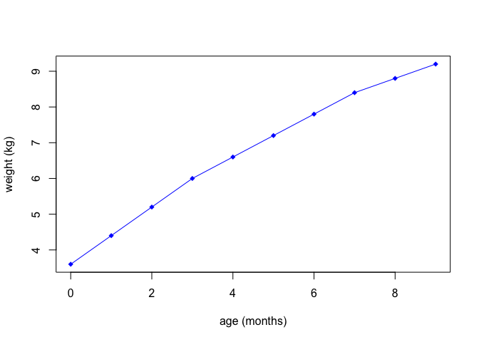
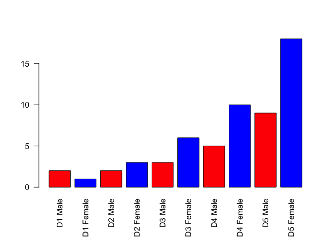

Class 5: Graphics
================

Class 5 R graphics and plots
============================

``` r
# get the data in
weight <- read.table("bimm143_05_rstats/weight_chart.txt",
                     header = TRUE)
```

``` r
# plot a scatterplot of age vs. weight
plot(weight$Age, weight$Weight, xlab = "age (months)", 
     ylab = "weight (kg)", pch = 18, col = "blue", type = "o")
```



``` r
# get the data in
feature <- read.table("bimm143_05_rstats/feature_counts.txt", 
                      header = TRUE, sep = "\t")
```

``` r
# plot a barplot of feature vs. count
barplot(feature$Count, names.arg = feature$Feature, las = 2,
        horiz = 2)
```


``` r
# my labels are clipped I need to change the margins
old.par <- par()$mar

par(mar=c(5,11,4,1))
barplot(feature$Count, names.arg = feature$Feature, las = 2,
        horiz = 2)
```


``` r
par(mar=c(5,5,4,1))
hist(c(rnorm(10000), rnorm(10000)+4), breaks = 80, xlab = "x",
     main = "histogram of x")
```


``` r
# section 3
mf <- read.table("bimm143_05_rstats/male_female_counts.txt",
                 header = TRUE, sep = "\t")

barplot(mf$Count, names.arg = mf$Sample, las=2, col=c("red", "blue"))
```



``` r
barplot(mf$Count, names.arg = mf$Sample, las=2, col=2)
```


``` r
barplot(mf$Count, names.arg = mf$Sample, las=2, col=1:4)
```


``` r
barplot(mf$Count, names.arg = mf$Sample, las=2, col=rainbow(10))
```


``` r
rainbow(10)
```

    ##  [1] "#FF0000FF" "#FF9900FF" "#CCFF00FF" "#33FF00FF" "#00FF66FF"
    ##  [6] "#00FFFFFF" "#0066FFFF" "#3300FFFF" "#CC00FFFF" "#FF0099FF"

``` r
# section 4

genes <- read.delim("bimm143_05_rstats/up_down_expression.txt",
                    header = TRUE)

nrow(genes)
```

    ## [1] 5196

``` r
ncol(genes)
```

    ## [1] 4

``` r
unique(genes$State)
```

    ## [1] unchanging up         down      
    ## Levels: down unchanging up

``` r
table(genes$State)
```

    ## 
    ##       down unchanging         up 
    ##         72       4997        127

``` r
plot(genes$Condition1, genes$Condition2, col=genes$State, 
     xlab = "Condition1", ylab = "Condition 2")
```


``` r
palette(c("blue", "gray", "red"))
```
