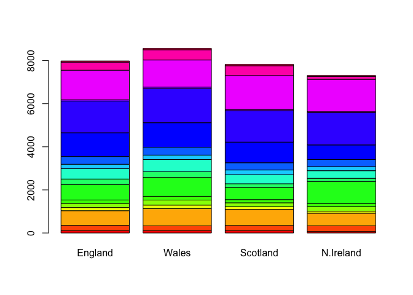

Class 8: Machine learning
================
Kellie Lemoine
April 26, 2019

Kmeans clustering
-----------------

Let's try out the **kmeans()** function in R with some makeup data

``` r
tmp <- c(rnorm(30,-3), rnorm(30,3))
x <- cbind(x=tmp, y=rev(tmp))

plot(x)
```


Use the Kmeans() function setting k to 2 and nstart=20

``` r
km <- kmeans(x, centers = 2, 20)
km
```

    ## K-means clustering with 2 clusters of sizes 30, 30
    ## 
    ## Cluster means:
    ##           x         y
    ## 1  3.057745 -3.127926
    ## 2 -3.127926  3.057745
    ## 
    ## Clustering vector:
    ##  [1] 2 2 2 2 2 2 2 2 2 2 2 2 2 2 2 2 2 2 2 2 2 2 2 2 2 2 2 2 2 2 1 1 1 1 1
    ## [36] 1 1 1 1 1 1 1 1 1 1 1 1 1 1 1 1 1 1 1 1 1 1 1 1 1
    ## 
    ## Within cluster sum of squares by cluster:
    ## [1] 73.42291 73.42291
    ##  (between_SS / total_SS =  88.7 %)
    ## 
    ## Available components:
    ## 
    ## [1] "cluster"      "centers"      "totss"        "withinss"    
    ## [5] "tot.withinss" "betweenss"    "size"         "iter"        
    ## [9] "ifault"

Inspect/print the results

> How many points are in each cluster?

``` r
km$size
```

    ## [1] 30 30

``` r
table(km$cluster)
```

    ## 
    ##  1  2 
    ## 30 30

> Q. What ‘component’ of your result object details - cluster size? nstart - cluster assignment/membership? - cluster center?

``` r
km$centers
```

    ##           x         y
    ## 1  3.057745 -3.127926
    ## 2 -3.127926  3.057745

Plot x colored by the kmeans cluster assignment and add cluster centers as blue points

``` r
plot(x, col = km$cluster)
points(km$centers, col = "blue", pch = 18, cex = 3)
```


Hierarchial Clustering
----------------------

Here we don't have to spell out K the number of clusters before hand but we do have to give it a distance matrix

``` r
d <- dist(x)
hc <- hclust(dist(x))
hc
```

    ## 
    ## Call:
    ## hclust(d = dist(x))
    ## 
    ## Cluster method   : complete 
    ## Distance         : euclidean 
    ## Number of objects: 60

Lets plot the results

``` r
plot(hc)
abline(h=6, col="red")
```


``` r
cutree(hc, h= 6)
```

    ##  [1] 1 1 1 1 1 1 1 1 1 1 1 1 1 1 1 1 1 1 1 1 1 1 1 1 1 1 1 1 1 1 2 2 2 2 2
    ## [36] 2 2 2 2 2 2 2 2 2 2 2 2 2 2 2 2 2 2 2 2 2 2 2 2 2

``` r
gp2 <- cutree(hc, k= 2)
gp3 <- cutree(hc, k=2)
```

``` r
table(gp2)
```

    ## gp2
    ##  1  2 
    ## 30 30

``` r
table(gp3)
```

    ## gp3
    ##  1  2 
    ## 30 30

``` r
table(gp2, gp3)
```

    ##    gp3
    ## gp2  1  2
    ##   1 30  0
    ##   2  0 30

Try a more real-life example to see how our clustering works

``` r
# Step 1. Generate some example data for clustering
x <- rbind(
 matrix(rnorm(100, mean=0, sd = 0.3), ncol = 2), # c1
 matrix(rnorm(100, mean = 1, sd = 0.3), ncol = 2), # c2
 matrix(c(rnorm(50, mean = 1, sd = 0.3), # c3
 rnorm(50, mean = 0, sd = 0.3)), ncol = 2))
colnames(x) <- c("x", "y")
# Step 2. Plot the data without clustering
plot(x)
```


``` r
# Step 3. Generate colors for known clusters
# (just so we can compare to hclust results)
col <- as.factor( rep(c("c1","c2","c3"), each=50) )
plot(x, col=col)
```


> Q. Use the dist(), hclust(), plot() and cutree() functions to return 2 and 3 clusters

``` r
#hc <- hclust(dist(x))
#plot(hc)
#abline(1.8)
#cutree(hc, h = 2)
```

``` r
plot(x, col = gp3)
```


> Q. How does this compare to your known 'col' groups?

Principal Component Analysis (PCA)

We will use the base R **prcomp()** function for PCA today...

Let's fet some RNASeq data to play with

``` r
mydata <- read.csv("https://tinyurl.com/expression-CSV",
 row.names=1)

head(mydata) 
```

    ##        wt1 wt2  wt3  wt4 wt5 ko1 ko2 ko3 ko4 ko5
    ## gene1  439 458  408  429 420  90  88  86  90  93
    ## gene2  219 200  204  210 187 427 423 434 433 426
    ## gene3 1006 989 1030 1017 973 252 237 238 226 210
    ## gene4  783 792  829  856 760 849 856 835 885 894
    ## gene5  181 249  204  244 225 277 305 272 270 279
    ## gene6  460 502  491  491 493 612 594 577 618 638

There are `r`nrow(mydata)\` genes in this dataset

``` r
pca <- prcomp( t(mydata), scale=TRUE)
summary(pca) 
```

    ## Importance of components:
    ##                           PC1    PC2     PC3     PC4     PC5     PC6
    ## Standard deviation     9.6237 1.5198 1.05787 1.05203 0.88062 0.82545
    ## Proportion of Variance 0.9262 0.0231 0.01119 0.01107 0.00775 0.00681
    ## Cumulative Proportion  0.9262 0.9493 0.96045 0.97152 0.97928 0.98609
    ##                            PC7     PC8     PC9      PC10
    ## Standard deviation     0.80111 0.62065 0.60342 3.348e-15
    ## Proportion of Variance 0.00642 0.00385 0.00364 0.000e+00
    ## Cumulative Proportion  0.99251 0.99636 1.00000 1.000e+00

``` r
attributes(pca)
```

    ## $names
    ## [1] "sdev"     "rotation" "center"   "scale"    "x"       
    ## 
    ## $class
    ## [1] "prcomp"

Let's make our first PCA plot

``` r
plot(pca$x[,1], pca$x[,2])
```


``` r
## Precent variance is often more informative to look at
pca.var <- pca$sdev^2
pca.var.per <- round(pca.var/sum(pca.var)*100, 1)

pca.var.per
```

    ##  [1] 92.6  2.3  1.1  1.1  0.8  0.7  0.6  0.4  0.4  0.0

``` r
plot(pca$x[,1], pca$x[,2], xlab = paste("PC1 (",pca.var.per[1],"%)", sep=""))
```


``` r
xlab <- paste("PC1 (",pca.var.per[1],"%)", sep="")
ylab <- paste("PC2 (",pca.var.per[2],"%)", sep="")

xlab
```

    ## [1] "PC1 (92.6%)"

``` r
ylab
```

    ## [1] "PC2 (2.3%)"

``` r
mycols <- c( rep("red", 5), rep("blue", 5))
```

``` r
plot(pca$x[,1], pca$x[,2], xlab=xlab, ylab=ylab, col=mycols)
text(pca$x[,1], pca$x[,2], colnames(mydata))
```


Hands on activity
-----------------

``` r
x <- read.csv("UK_foods.csv", row.names = 1)

nrow(x)
```

    ## [1] 17

``` r
ncol(x)
```

    ## [1] 4

``` r
## call view function

#View(x)
```

``` r
## Check dimensions

dim(x)
```

    ## [1] 17  4

``` r
## Generate a barplot of the data

barplot(as.matrix(x), beside=T, col=rainbow(nrow(x)))
```


``` r
barplot(as.matrix(x), beside=F, col=rainbow(nrow(x)))
```



``` r
pairs(x, col=rainbow(10), pch=16)
```


``` r
pca <- prcomp( t(x) )
summary(pca)
```

    ## Importance of components:
    ##                             PC1      PC2      PC3       PC4
    ## Standard deviation     324.1502 212.7478 73.87622 4.189e-14
    ## Proportion of Variance   0.6744   0.2905  0.03503 0.000e+00
    ## Cumulative Proportion    0.6744   0.9650  1.00000 1.000e+00

``` r
mycols <- c("orange", "red", "blue", "green")
plot(pca$x[,1], pca$x[,2])
text(pca$x[,1], pca$x[,2], colnames(x), col = mycols)
abline(h=0, col="gray", lty=2)
```


