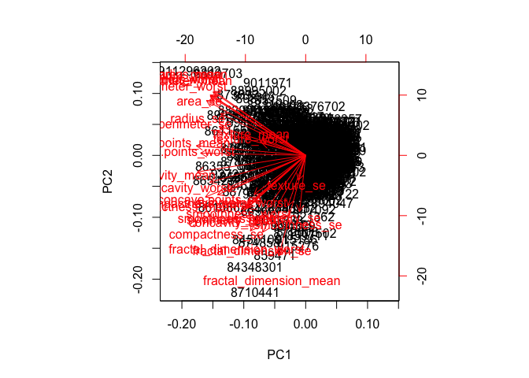
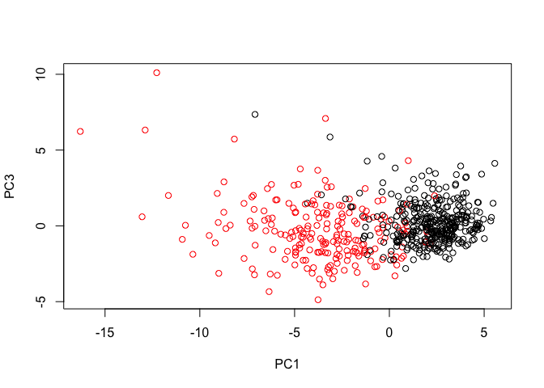

Class09
================
Kellie Lemoine
May 1, 2019

Import data
-----------

``` r
fna.data <- "data/WisconsinCancer.csv"
```

``` r
wisc.df <- read.csv("WisconsinCancer.csv")
head(wisc.df)
```

    ##         id diagnosis radius_mean texture_mean perimeter_mean area_mean
    ## 1   842302         M       17.99        10.38         122.80    1001.0
    ## 2   842517         M       20.57        17.77         132.90    1326.0
    ## 3 84300903         M       19.69        21.25         130.00    1203.0
    ## 4 84348301         M       11.42        20.38          77.58     386.1
    ## 5 84358402         M       20.29        14.34         135.10    1297.0
    ## 6   843786         M       12.45        15.70          82.57     477.1
    ##   smoothness_mean compactness_mean concavity_mean concave.points_mean
    ## 1         0.11840          0.27760         0.3001             0.14710
    ## 2         0.08474          0.07864         0.0869             0.07017
    ## 3         0.10960          0.15990         0.1974             0.12790
    ## 4         0.14250          0.28390         0.2414             0.10520
    ## 5         0.10030          0.13280         0.1980             0.10430
    ## 6         0.12780          0.17000         0.1578             0.08089
    ##   symmetry_mean fractal_dimension_mean radius_se texture_se perimeter_se
    ## 1        0.2419                0.07871    1.0950     0.9053        8.589
    ## 2        0.1812                0.05667    0.5435     0.7339        3.398
    ## 3        0.2069                0.05999    0.7456     0.7869        4.585
    ## 4        0.2597                0.09744    0.4956     1.1560        3.445
    ## 5        0.1809                0.05883    0.7572     0.7813        5.438
    ## 6        0.2087                0.07613    0.3345     0.8902        2.217
    ##   area_se smoothness_se compactness_se concavity_se concave.points_se
    ## 1  153.40      0.006399        0.04904      0.05373           0.01587
    ## 2   74.08      0.005225        0.01308      0.01860           0.01340
    ## 3   94.03      0.006150        0.04006      0.03832           0.02058
    ## 4   27.23      0.009110        0.07458      0.05661           0.01867
    ## 5   94.44      0.011490        0.02461      0.05688           0.01885
    ## 6   27.19      0.007510        0.03345      0.03672           0.01137
    ##   symmetry_se fractal_dimension_se radius_worst texture_worst
    ## 1     0.03003             0.006193        25.38         17.33
    ## 2     0.01389             0.003532        24.99         23.41
    ## 3     0.02250             0.004571        23.57         25.53
    ## 4     0.05963             0.009208        14.91         26.50
    ## 5     0.01756             0.005115        22.54         16.67
    ## 6     0.02165             0.005082        15.47         23.75
    ##   perimeter_worst area_worst smoothness_worst compactness_worst
    ## 1          184.60     2019.0           0.1622            0.6656
    ## 2          158.80     1956.0           0.1238            0.1866
    ## 3          152.50     1709.0           0.1444            0.4245
    ## 4           98.87      567.7           0.2098            0.8663
    ## 5          152.20     1575.0           0.1374            0.2050
    ## 6          103.40      741.6           0.1791            0.5249
    ##   concavity_worst concave.points_worst symmetry_worst
    ## 1          0.7119               0.2654         0.4601
    ## 2          0.2416               0.1860         0.2750
    ## 3          0.4504               0.2430         0.3613
    ## 4          0.6869               0.2575         0.6638
    ## 5          0.4000               0.1625         0.2364
    ## 6          0.5355               0.1741         0.3985
    ##   fractal_dimension_worst  X
    ## 1                 0.11890 NA
    ## 2                 0.08902 NA
    ## 3                 0.08758 NA
    ## 4                 0.17300 NA
    ## 5                 0.07678 NA
    ## 6                 0.12440 NA

Determine number of patients with malignant tumors
--------------------------------------------------

``` r
table(wisc.df$diagnosis)
```

    ## 
    ##   B   M 
    ## 357 212

How many variables/features in the data are suffixed with \_mean?
-----------------------------------------------------------------

``` r
length(grep("_mean", colnames(wisc.df)))
```

    ## [1] 10

Select cols 3:32 and store it as a matrix

``` r
wisc.data <- as.matrix(wisc.df[ , 3:32])
```

``` r
row.names(wisc.data) <- wisc.df$id
```

``` r
diagnosis <- wisc.df$diagnosis
```

Section 2: Principal Component Analysis (PCA)

Check column means and standard deviations
------------------------------------------

``` r
round(apply(wisc.data, 2, mean), 1)
```

    ##             radius_mean            texture_mean          perimeter_mean 
    ##                    14.1                    19.3                    92.0 
    ##               area_mean         smoothness_mean        compactness_mean 
    ##                   654.9                     0.1                     0.1 
    ##          concavity_mean     concave.points_mean           symmetry_mean 
    ##                     0.1                     0.0                     0.2 
    ##  fractal_dimension_mean               radius_se              texture_se 
    ##                     0.1                     0.4                     1.2 
    ##            perimeter_se                 area_se           smoothness_se 
    ##                     2.9                    40.3                     0.0 
    ##          compactness_se            concavity_se       concave.points_se 
    ##                     0.0                     0.0                     0.0 
    ##             symmetry_se    fractal_dimension_se            radius_worst 
    ##                     0.0                     0.0                    16.3 
    ##           texture_worst         perimeter_worst              area_worst 
    ##                    25.7                   107.3                   880.6 
    ##        smoothness_worst       compactness_worst         concavity_worst 
    ##                     0.1                     0.3                     0.3 
    ##    concave.points_worst          symmetry_worst fractal_dimension_worst 
    ##                     0.1                     0.3                     0.1

``` r
round(apply(wisc.data, 2, sd), 1)
```

    ##             radius_mean            texture_mean          perimeter_mean 
    ##                     3.5                     4.3                    24.3 
    ##               area_mean         smoothness_mean        compactness_mean 
    ##                   351.9                     0.0                     0.1 
    ##          concavity_mean     concave.points_mean           symmetry_mean 
    ##                     0.1                     0.0                     0.0 
    ##  fractal_dimension_mean               radius_se              texture_se 
    ##                     0.0                     0.3                     0.6 
    ##            perimeter_se                 area_se           smoothness_se 
    ##                     2.0                    45.5                     0.0 
    ##          compactness_se            concavity_se       concave.points_se 
    ##                     0.0                     0.0                     0.0 
    ##             symmetry_se    fractal_dimension_se            radius_worst 
    ##                     0.0                     0.0                     4.8 
    ##           texture_worst         perimeter_worst              area_worst 
    ##                     6.1                    33.6                   569.4 
    ##        smoothness_worst       compactness_worst         concavity_worst 
    ##                     0.0                     0.2                     0.2 
    ##    concave.points_worst          symmetry_worst fractal_dimension_worst 
    ##                     0.1                     0.1                     0.0

``` r
wisc.pr <- prcomp(wisc.data, scale. = TRUE)

summary(wisc.pr)
```

    ## Importance of components:
    ##                           PC1    PC2     PC3     PC4     PC5     PC6
    ## Standard deviation     3.6444 2.3857 1.67867 1.40735 1.28403 1.09880
    ## Proportion of Variance 0.4427 0.1897 0.09393 0.06602 0.05496 0.04025
    ## Cumulative Proportion  0.4427 0.6324 0.72636 0.79239 0.84734 0.88759
    ##                            PC7     PC8    PC9    PC10   PC11    PC12
    ## Standard deviation     0.82172 0.69037 0.6457 0.59219 0.5421 0.51104
    ## Proportion of Variance 0.02251 0.01589 0.0139 0.01169 0.0098 0.00871
    ## Cumulative Proportion  0.91010 0.92598 0.9399 0.95157 0.9614 0.97007
    ##                           PC13    PC14    PC15    PC16    PC17    PC18
    ## Standard deviation     0.49128 0.39624 0.30681 0.28260 0.24372 0.22939
    ## Proportion of Variance 0.00805 0.00523 0.00314 0.00266 0.00198 0.00175
    ## Cumulative Proportion  0.97812 0.98335 0.98649 0.98915 0.99113 0.99288
    ##                           PC19    PC20   PC21    PC22    PC23   PC24
    ## Standard deviation     0.22244 0.17652 0.1731 0.16565 0.15602 0.1344
    ## Proportion of Variance 0.00165 0.00104 0.0010 0.00091 0.00081 0.0006
    ## Cumulative Proportion  0.99453 0.99557 0.9966 0.99749 0.99830 0.9989
    ##                           PC25    PC26    PC27    PC28    PC29    PC30
    ## Standard deviation     0.12442 0.09043 0.08307 0.03987 0.02736 0.01153
    ## Proportion of Variance 0.00052 0.00027 0.00023 0.00005 0.00002 0.00000
    ## Cumulative Proportion  0.99942 0.99969 0.99992 0.99997 1.00000 1.00000

Generate a biplot of the data
-----------------------------

``` r
biplot(wisc.pr)
```



Generate a clearer plot of the data
-----------------------------------

``` r
plot(wisc.pr$x[,1], wisc.pr$x[,2], col = diagnosis, xlab = "PC1", ylab = "PC2")
```


``` r
plot(wisc.pr$x[,1], wisc.pr$x[,3], col = diagnosis, xlab = "PC1", ylab = "PC3")
```



Calculate variance
------------------

``` r
pr.var <- wisc.pr$sdev^2
head(pr.var)
```

    ## [1] 13.281608  5.691355  2.817949  1.980640  1.648731  1.207357

``` r
pve <- pr.var/0.4427
```

Plot variance explained for each principal component
----------------------------------------------------

``` r
plot(pve, xlab = "Principal Component", 
     ylab = "Proportion of Variance Explained", 
     ylim = c(0, 1), type = "o")
```


``` r
barplot(pve, ylab = "Precent of Variance Explained",
     names.arg=paste0("PC",1:length(pve)), las=2, axes = FALSE)
axis(2, at=pve, labels=round(pve,2)*100 )
```


Communicating PCA results
-------------------------

``` r
round(wisc.pr$rotation["radius_mean",1], 2)
```

    ## [1] -0.22

``` r
round(wisc.pr$rotation["smoothness_se",1], 2)
```

    ## [1] -0.01

``` r
sort(abs((wisc.pr$rotation[,1])))
```

    ##           smoothness_se              texture_se             symmetry_se 
    ##              0.01453145              0.01742803              0.04249842 
    ##  fractal_dimension_mean    fractal_dimension_se            texture_mean 
    ##              0.06436335              0.10256832              0.10372458 
    ##           texture_worst          symmetry_worst        smoothness_worst 
    ##              0.10446933              0.12290456              0.12795256 
    ## fractal_dimension_worst           symmetry_mean         smoothness_mean 
    ##              0.13178394              0.13816696              0.14258969 
    ##            concavity_se          compactness_se       concave.points_se 
    ##              0.15358979              0.17039345              0.18341740 
    ##                 area_se               radius_se       compactness_worst 
    ##              0.20286964              0.20597878              0.21009588 
    ##            perimeter_se             radius_mean               area_mean 
    ##              0.21132592              0.21890244              0.22099499 
    ##              area_worst          perimeter_mean            radius_worst 
    ##              0.22487053              0.22753729              0.22799663 
    ##         concavity_worst         perimeter_worst        compactness_mean 
    ##              0.22876753              0.23663968              0.23928535 
    ##    concave.points_worst          concavity_mean     concave.points_mean 
    ##              0.25088597              0.25840048              0.26085376

Section 3: Hierarchial Clustering

``` r
data.scaled <- scale(wisc.data)
data.dist <- dist(data.scaled)
wisc.hclust <- hclust(data.dist, method = "complete")
```

``` r
plot(wisc.hclust)

abline(h = 19, col="red", lty=2)
```


``` r
wisc.hclust.clusters <- cutree(wisc.hclust, h=19, k=4)
table(wisc.hclust.clusters)
```

    ## wisc.hclust.clusters
    ##   1   2   3   4 
    ## 177   7 383   2

``` r
table(wisc.hclust.clusters, diagnosis)
```

    ##                     diagnosis
    ## wisc.hclust.clusters   B   M
    ##                    1  12 165
    ##                    2   2   5
    ##                    3 343  40
    ##                    4   0   2

Section 5:Combining Methods

I am going to start with the PCs that capture 90% of the original variance in the dataset (i.e. PC1 to PC7)
-----------------------------------------------------------------------------------------------------------

``` r
wisc.pr.hclust <- hclust(dist(wisc.pr$x[,1:7]), method="ward.D2")

plot(wisc.pr.hclust)
```


``` r
grps <- cutree(wisc.pr.hclust, k=2)
table(grps)
```

    ## grps
    ##   1   2 
    ## 216 353

``` r
table(grps, diagnosis)
```

    ##     diagnosis
    ## grps   B   M
    ##    1  28 188
    ##    2 329  24

``` r
plot(wisc.pr$x[,1:2], col=grps)
```


``` r
plot(wisc.pr$x[,1:2], col=diagnosis)
```


``` r
url <- "https://tinyurl.com/new-samples-CSV"
new <- read.csv(url)
npc <- predict(wisc.pr, newdata=new)
npc
```

    ##            PC1       PC2        PC3        PC4       PC5        PC6
    ## [1,]  2.576616 -3.135913  1.3990492 -0.7631950  2.781648 -0.8150185
    ## [2,] -4.754928 -3.009033 -0.1660946 -0.6052952 -1.140698 -1.2189945
    ##             PC7        PC8       PC9       PC10      PC11      PC12
    ## [1,] -0.3959098 -0.2307350 0.1029569 -0.9272861 0.3411457  0.375921
    ## [2,]  0.8193031 -0.3307423 0.5281896 -0.4855301 0.7173233 -1.185917
    ##           PC13     PC14      PC15       PC16        PC17        PC18
    ## [1,] 0.1610764 1.187882 0.3216974 -0.1743616 -0.07875393 -0.11207028
    ## [2,] 0.5893856 0.303029 0.1299153  0.1448061 -0.40509706  0.06565549
    ##             PC19       PC20       PC21       PC22       PC23       PC24
    ## [1,] -0.08802955 -0.2495216  0.1228233 0.09358453 0.08347651  0.1223396
    ## [2,]  0.25591230 -0.4289500 -0.1224776 0.01732146 0.06316631 -0.2338618
    ##             PC25         PC26         PC27        PC28         PC29
    ## [1,]  0.02124121  0.078884581  0.220199544 -0.02946023 -0.015620933
    ## [2,] -0.20755948 -0.009833238 -0.001134152  0.09638361  0.002795349
    ##              PC30
    ## [1,]  0.005269029
    ## [2,] -0.019015820

``` r
plot(wisc.pr$x[,1:2], col=diagnosis)
points(npc[,1], npc[,2], col="blue", pch=16, cex=3)
text(npc[,1], npc[,2], c(1,2), col="white")
```


