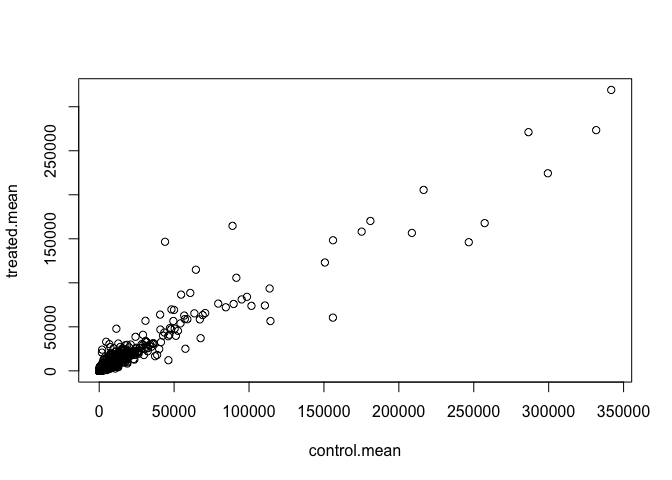
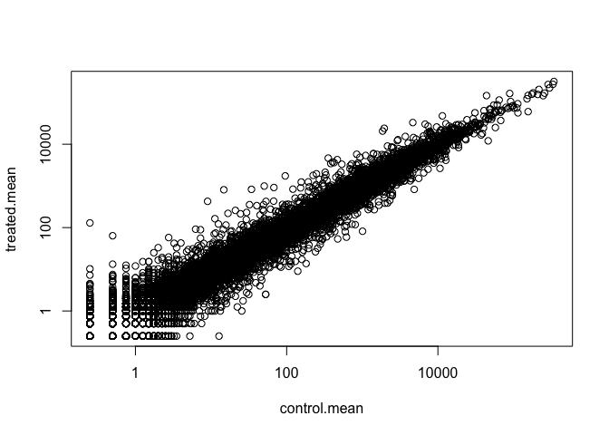
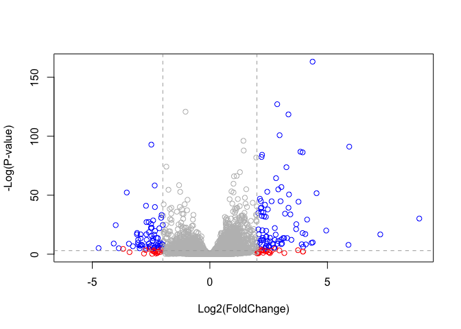

Class 14:Transcriptomics and the analysis of RNA-Seq data
================
Kellie Lemoine
May 17, 2019

``` r
#install.packages("BiocManager")
```

Import our countdata and coldata into R

``` r
counts <- read.csv("airway_scaledcounts.csv", stringsAsFactors = FALSE)
metadata <-  read.csv("airway_metadata.csv", stringsAsFactors = FALSE)
```

Q1. How many genes are we dealing with here?

``` r
nrow(counts)
```

    ## [1] 38694

Let's check if the cols of 'counts' is the same as the id column in 'metadata'

``` r
colnames(counts)
```

    ## [1] "ensgene"    "SRR1039508" "SRR1039509" "SRR1039512" "SRR1039513"
    ## [6] "SRR1039516" "SRR1039517" "SRR1039520" "SRR1039521"

``` r
metadata$id
```

    ## [1] "SRR1039508" "SRR1039509" "SRR1039512" "SRR1039513" "SRR1039516"
    ## [6] "SRR1039517" "SRR1039520" "SRR1039521"

``` r
all(colnames(counts)[-1] == metadata$id)
```

    ## [1] TRUE

Let's access just the control counts data so we can calculate an average counts value for eacch gene in these control samples.

``` r
control <- metadata[metadata[,"dex"]=="control",]
control
```

    ##           id     dex celltype     geo_id
    ## 1 SRR1039508 control   N61311 GSM1275862
    ## 3 SRR1039512 control  N052611 GSM1275866
    ## 5 SRR1039516 control  N080611 GSM1275870
    ## 7 SRR1039520 control  N061011 GSM1275874

Now we want to get the cols in counts with these 'control$id' colnames

``` r
control.mean <- rowSums( counts[ ,control$id] )/length(control$id)
names(control.mean) <- counts$ensgene
head(control.mean)
```

    ## ENSG00000000003 ENSG00000000005 ENSG00000000419 ENSG00000000457 
    ##          900.75            0.00          520.50          339.75 
    ## ENSG00000000460 ENSG00000000938 
    ##           97.25            0.75

Now do the same for the 'treated' samples...

``` r
treated <- metadata[metadata[,"dex"]=="treated",]
treated
```

    ##           id     dex celltype     geo_id
    ## 2 SRR1039509 treated   N61311 GSM1275863
    ## 4 SRR1039513 treated  N052611 GSM1275867
    ## 6 SRR1039517 treated  N080611 GSM1275871
    ## 8 SRR1039521 treated  N061011 GSM1275875

``` r
treated.mean <- rowSums( counts[ ,treated$id] )/length(treated$id)
names(treated.mean) <- counts$ensgene
```

Let's put these together into a new data.frame called 'meancounts'

``` r
meancounts <- data.frame(control.mean, treated.mean)
head(meancounts)
```

    ##                 control.mean treated.mean
    ## ENSG00000000003       900.75       658.00
    ## ENSG00000000005         0.00         0.00
    ## ENSG00000000419       520.50       546.00
    ## ENSG00000000457       339.75       316.50
    ## ENSG00000000460        97.25        78.75
    ## ENSG00000000938         0.75         0.00

``` r
plot(meancounts)
```



Plot on a log scale for both axis

``` r
plot(meancounts, log="xy")
```

    ## Warning in xy.coords(x, y, xlabel, ylabel, log): 15032 x values <= 0
    ## omitted from logarithmic plot

    ## Warning in xy.coords(x, y, xlabel, ylabel, log): 15281 y values <= 0
    ## omitted from logarithmic plot



Calculate fold change and use log2 values

``` r
meancounts$log2fc <- log2(meancounts[,"treated.mean"]/meancounts[,"control.mean"])
head(meancounts)
```

    ##                 control.mean treated.mean      log2fc
    ## ENSG00000000003       900.75       658.00 -0.45303916
    ## ENSG00000000005         0.00         0.00         NaN
    ## ENSG00000000419       520.50       546.00  0.06900279
    ## ENSG00000000457       339.75       316.50 -0.10226805
    ## ENSG00000000460        97.25        78.75 -0.30441833
    ## ENSG00000000938         0.75         0.00        -Inf

Remove the NaN and -inf

``` r
#Identify the rows (i.e. genes) with xero values
to.rm <- unique(which(meancounts[,1:2]==0, arr.ind = TRUE)[,1])

#Remove these rows as we can't really say much about them
mycounts <- meancounts[-to.rm,]
head(mycounts)
```

    ##                 control.mean treated.mean      log2fc
    ## ENSG00000000003       900.75       658.00 -0.45303916
    ## ENSG00000000419       520.50       546.00  0.06900279
    ## ENSG00000000457       339.75       316.50 -0.10226805
    ## ENSG00000000460        97.25        78.75 -0.30441833
    ## ENSG00000000971      5219.00      6687.50  0.35769358
    ## ENSG00000001036      2327.00      1785.75 -0.38194109

A common threshold used for calling something differentially expressed is a log2(FoldChange) of greater than 2 or less than -2. Let’s filter the dataset both ways to see how many genes are up or down-regulated.

Q8. Using the up.ind vector above can you determine how many up regulated genes we have at the greater than 2 fc level?

``` r
up.ind <- mycounts$log2fc > 2
sum(up.ind)
```

    ## [1] 250

``` r
down.ind <- mycounts$log2fc < (-2)
sum(down.ind)
```

    ## [1] 367

Adding annotation data

Read annotation data from ENSEMBLE...

``` r
anno <- read.csv("annotables_grch38.csv")
```

We will use the **merge()** function to add annotation data to our 'mycounts' results

``` r
mycounts.anno <- merge(x=mycounts, y=anno, by.x="row.names", by.y="ensgene")
```

We can use bioconductor to do this too

``` r
library("AnnotationDbi")
```

    ## Loading required package: stats4

    ## Loading required package: BiocGenerics

    ## Loading required package: parallel

    ## 
    ## Attaching package: 'BiocGenerics'

    ## The following objects are masked from 'package:parallel':
    ## 
    ##     clusterApply, clusterApplyLB, clusterCall, clusterEvalQ,
    ##     clusterExport, clusterMap, parApply, parCapply, parLapply,
    ##     parLapplyLB, parRapply, parSapply, parSapplyLB

    ## The following objects are masked from 'package:stats':
    ## 
    ##     IQR, mad, sd, var, xtabs

    ## The following objects are masked from 'package:base':
    ## 
    ##     anyDuplicated, append, as.data.frame, basename, cbind,
    ##     colMeans, colnames, colSums, dirname, do.call, duplicated,
    ##     eval, evalq, Filter, Find, get, grep, grepl, intersect,
    ##     is.unsorted, lapply, lengths, Map, mapply, match, mget, order,
    ##     paste, pmax, pmax.int, pmin, pmin.int, Position, rank, rbind,
    ##     Reduce, rowMeans, rownames, rowSums, sapply, setdiff, sort,
    ##     table, tapply, union, unique, unsplit, which, which.max,
    ##     which.min

    ## Loading required package: Biobase

    ## Welcome to Bioconductor
    ## 
    ##     Vignettes contain introductory material; view with
    ##     'browseVignettes()'. To cite Bioconductor, see
    ##     'citation("Biobase")', and for packages 'citation("pkgname")'.

    ## Loading required package: IRanges

    ## Loading required package: S4Vectors

    ## 
    ## Attaching package: 'S4Vectors'

    ## The following object is masked from 'package:base':
    ## 
    ##     expand.grid

``` r
library("org.Hs.eg.db")
```

    ## 

``` r
columns(org.Hs.eg.db)
```

    ##  [1] "ACCNUM"       "ALIAS"        "ENSEMBL"      "ENSEMBLPROT" 
    ##  [5] "ENSEMBLTRANS" "ENTREZID"     "ENZYME"       "EVIDENCE"    
    ##  [9] "EVIDENCEALL"  "GENENAME"     "GO"           "GOALL"       
    ## [13] "IPI"          "MAP"          "OMIM"         "ONTOLOGY"    
    ## [17] "ONTOLOGYALL"  "PATH"         "PFAM"         "PMID"        
    ## [21] "PROSITE"      "REFSEQ"       "SYMBOL"       "UCSCKG"      
    ## [25] "UNIGENE"      "UNIPROT"

``` r
mycounts$symbol <- mapIds(org.Hs.eg.db,
                     keys=row.names(mycounts), # Our genenames
                     keytype="ENSEMBL",        # The format of our genenames
                     column="SYMBOL",          # The new format we want to add
                     multiVals="first")
```

    ## 'select()' returned 1:many mapping between keys and columns

``` r
mycounts$entrez <- mapIds(org.Hs.eg.db,
                     keys=row.names(mycounts),
                     column="ENTREZID",
                     keytype="ENSEMBL",
                     multiVals="first")
```

    ## 'select()' returned 1:many mapping between keys and columns

``` r
mycounts$uniprot <- mapIds(org.Hs.eg.db,
                     keys=row.names(mycounts),
                     column="UNIPROT",
                     keytype="ENSEMBL",
                     multiVals="first")
```

    ## 'select()' returned 1:many mapping between keys and columns

``` r
head(mycounts)
```

    ##                 control.mean treated.mean      log2fc   symbol entrez
    ## ENSG00000000003       900.75       658.00 -0.45303916   TSPAN6   7105
    ## ENSG00000000419       520.50       546.00  0.06900279     DPM1   8813
    ## ENSG00000000457       339.75       316.50 -0.10226805    SCYL3  57147
    ## ENSG00000000460        97.25        78.75 -0.30441833 C1orf112  55732
    ## ENSG00000000971      5219.00      6687.50  0.35769358      CFH   3075
    ## ENSG00000001036      2327.00      1785.75 -0.38194109    FUCA2   2519
    ##                    uniprot
    ## ENSG00000000003 A0A024RCI0
    ## ENSG00000000419     O60762
    ## ENSG00000000457     Q8IZE3
    ## ENSG00000000460 A0A024R922
    ## ENSG00000000971 A0A024R962
    ## ENSG00000001036     Q9BTY2

``` r
View( mycounts[up.ind,] )
```

Section 5: DESeq2 analysis

Let's do this the right way/ DESeq2 is an R package for analyzing count-based NGS data like RNA-seq. It is available from bioconductor

``` r
library("DESeq2")
```

    ## Loading required package: GenomicRanges

    ## Loading required package: GenomeInfoDb

    ## Loading required package: SummarizedExperiment

    ## Loading required package: DelayedArray

    ## Loading required package: matrixStats

    ## 
    ## Attaching package: 'matrixStats'

    ## The following objects are masked from 'package:Biobase':
    ## 
    ##     anyMissing, rowMedians

    ## Loading required package: BiocParallel

    ## 
    ## Attaching package: 'DelayedArray'

    ## The following objects are masked from 'package:matrixStats':
    ## 
    ##     colMaxs, colMins, colRanges, rowMaxs, rowMins, rowRanges

    ## The following objects are masked from 'package:base':
    ## 
    ##     aperm, apply

``` r
citation("DESeq2")
```

    ## 
    ##   Love, M.I., Huber, W., Anders, S. Moderated estimation of fold
    ##   change and dispersion for RNA-seq data with DESeq2 Genome
    ##   Biology 15(12):550 (2014)
    ## 
    ## A BibTeX entry for LaTeX users is
    ## 
    ##   @Article{,
    ##     title = {Moderated estimation of fold change and dispersion for RNA-seq data with DESeq2},
    ##     author = {Michael I. Love and Wolfgang Huber and Simon Anders},
    ##     year = {2014},
    ##     journal = {Genome Biology},
    ##     doi = {10.1186/s13059-014-0550-8},
    ##     volume = {15},
    ##     issue = {12},
    ##     pages = {550},
    ##   }

Build our deseq dataset object need for running deseq analysis

``` r
dds <- DESeqDataSetFromMatrix(countData=counts, 
                              colData=metadata, 
                              design=~dex, 
                              tidy=TRUE)
```

    ## converting counts to integer mode

    ## Warning in DESeqDataSet(se, design = design, ignoreRank): some variables in
    ## design formula are characters, converting to factors

``` r
#dds
```

``` r
dds <- DESeq(dds)
```

    ## estimating size factors

    ## estimating dispersions

    ## gene-wise dispersion estimates

    ## mean-dispersion relationship

    ## final dispersion estimates

    ## fitting model and testing

Get our results

``` r
res <- results(dds)
#as.data.frame(res)
```

``` r
summary(res)
```

    ## 
    ## out of 25258 with nonzero total read count
    ## adjusted p-value < 0.1
    ## LFC > 0 (up)       : 1563, 6.2%
    ## LFC < 0 (down)     : 1188, 4.7%
    ## outliers [1]       : 142, 0.56%
    ## low counts [2]     : 9971, 39%
    ## (mean count < 10)
    ## [1] see 'cooksCutoff' argument of ?results
    ## [2] see 'independentFiltering' argument of ?results

``` r
res05 <- results(dds, alpha = 0.05)
summary(res05)
```

    ## 
    ## out of 25258 with nonzero total read count
    ## adjusted p-value < 0.05
    ## LFC > 0 (up)       : 1236, 4.9%
    ## LFC < 0 (down)     : 933, 3.7%
    ## outliers [1]       : 142, 0.56%
    ## low counts [2]     : 9033, 36%
    ## (mean count < 6)
    ## [1] see 'cooksCutoff' argument of ?results
    ## [2] see 'independentFiltering' argument of ?results

``` r
mycols <- rep("gray", nrow(res))
mycols[ abs(res$log2FoldChange) > 2 ]  <- "red" 

inds <- (res$padj < 0.01) & (abs(res$log2FoldChange) > 2 )
mycols[ inds ] <- "blue"

plot( res$log2FoldChange,  -log(res$padj), col=mycols, 
 ylab="-Log(P-value)", xlab="Log2(FoldChange)")

abline(v=c(-2,2), col="darkgray", lty=2)
abline(h=-log(0.05), col="darkgray", lty=2)
```



Another way to plot this is with the Enhanced

But first lets putproper gene names on our results (i.e. gene 'symbols')

``` r
x <- as.data.frame(res)
x$symbol <- mapIds(org.Hs.eg.db, 
                   keys=row.names(x),
                   keytype="ENSEMBL",
                   column="SYMBOL",
                   multiVals="first")
```

    ## 'select()' returned 1:many mapping between keys and columns
