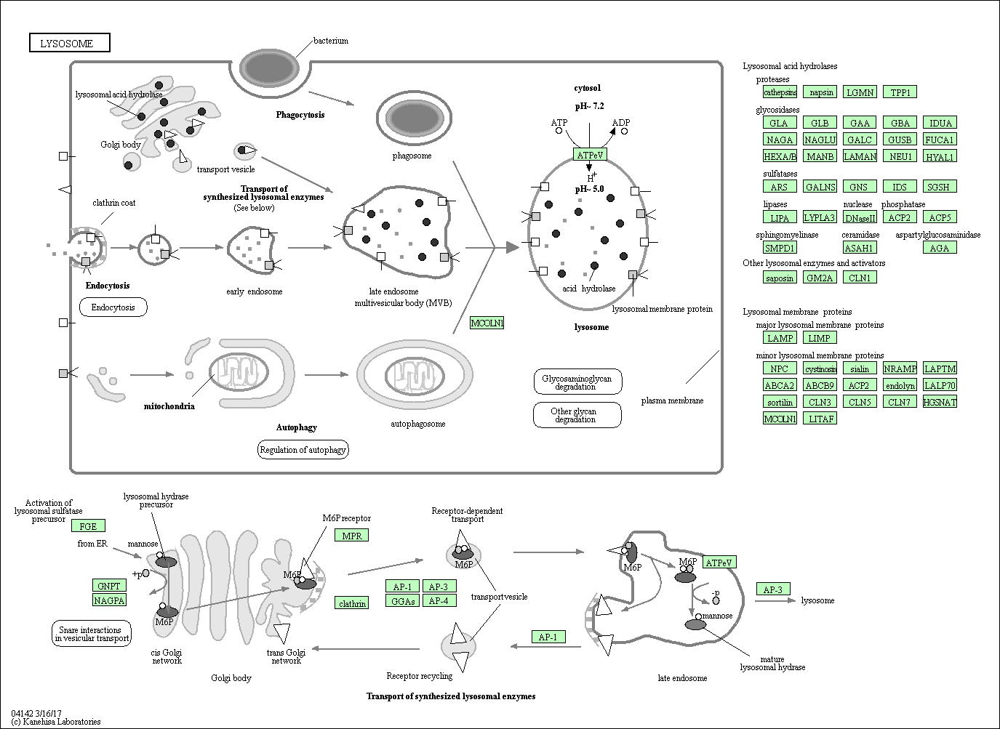

```{r setup, include=FALSE}
knitr::opts_chunk$set(echo = TRUE)
```

Section 1. Differential Expression Analysis

```{r}
library(DESeq2)
```

# Load our input coutData and coldData files

```{r}
metaFile <- "GSE37704_metadata.csv"
countFile <- "GSE37704_featurecounts.csv"

# Import metadata and take a peak
colData = read.csv(metaFile, row.names=1)
head(colData)
```

```{r}
# Import countdata
countData = read.csv(countFile, row.names=1)
head(countData)
```

```{r}
# Note we need to remove the odd first $length col (so that the colData and countData match up)
countData <- countData[,-1]
head(countData)
```

```{r}
# Filter count data where you have 0 read count across all samples.
nonzero.inds <- rowSums(countData) != 0
countData <- countData[nonzero.inds, ]
head(countData)
```

# Running DESeq2

```{r}
dds = DESeqDataSetFromMatrix(countData=countData,
                             colData=colData,
                             design=~condition)
dds = DESeq(dds)
```

Get our results

```{r}
res <- results(dds)
head(res)
```

```{r}
summary(res)
```

# Volcano Plot

```{r}
plot( res$log2FoldChange, -log(res$pvalue) )
abline(v=c(-2,2), h=2, col="green")
```

```{r}
# Make a color vector for all genes
mycols <- rep("gray", nrow(res) )

# Color red the genes with absolute fold change above 2
mycols[ abs(res$log2FoldChange) > 2 ] <- "red"

# Color blue those with adjusted p-value less than 0.01
#  and absolute fold change more than 2
inds <- (res$pvalue) < 0.01 & (abs(res$log2FoldChange) > 2 )
mycols[ inds ] <- "blue"

plot( res$log2FoldChange, -log(res$padj), col=mycols, xlab="Log2(FoldChange)", ylab="-Log(P-value)" )

abline(v=c(-2,2), h=2, col="green")
```

# Adding Gene Annotation

```{r}
#Since we mapped and counted against the Ensembl annotation, our results only have information about Ensembl gene IDs. However, our pathway analysis downstream will use KEGG pathways, and genes in KEGG pathways are annotated with Entrez gene IDs. So lets add them.

library("AnnotationDbi")
library("org.Hs.eg.db")

columns(org.Hs.eg.db)

res$symbol = mapIds(org.Hs.eg.db,
                    keys=rownames(res), 
                    keytype="ENSEMBL",
                    column="SYMBOL",
                    multiVals="first")

res$entrez = mapIds(org.Hs.eg.db,
                    keys=rownames(res),
                    keytype="ENSEMBL",
                    column="ENTREZID",
                    multiVals="first")

res$name =   mapIds(org.Hs.eg.db,
                    keys=row.names(res),
                    keytype="ENSEMBL",
                    column="GENENAME",
                    multiVals="first")

head(res, 10)
```

```{r}
# let's reorder these results by adjusted p-value and save them to a CSV file in your current project directory.
res = res[order(res$pvalue),]
write.csv(res, file="deseq_results.csv")
```


Section 2. Pathway Analysis

```{r}
library(pathview)
```

```{r}
library(gage)
library(gageData)

data(kegg.sets.hs)
data(sigmet.idx.hs)

# Focus on signaling and metabolic pathways only
kegg.sets.hs = kegg.sets.hs[sigmet.idx.hs]

# Examine the first 3 pathways
head(kegg.sets.hs, 3)
```

```{r}
# The **gage** package wants a vector as input with our numeric scores of interest with the vector names being ENTREZ IDs
foldchanges = res$log2FoldChange
names(foldchanges) = res$entrez
head(foldchanges)
```

```{r}
# Get the results
keggres = gage(foldchanges, gsets=kegg.sets.hs)
```

```{r}
attributes(keggres)
```

```{r}
head(keggres$less)
```

```{r}
pathview(gene.data=foldchanges, pathway.id="hsa04110")
```


```{r}
# A different PDF based output of the same data
pathview(gene.data=foldchanges, pathway.id="hsa04110", kegg.native=FALSE)
```


```{r}
## Focus on top 5 upregulated pathways here for demo purposes only
keggrespathways <- rownames(keggres$greater)[1:5]

# Extract the 8 character long IDs part of each string
keggresids = substr(keggrespathways, start=1, stop=8)
keggresids
```


```{r}
pathview(gene.data=foldchanges, pathway.id=keggresids, species="hsa")
```


 




Section 3. Gene Ontology

```{r}
data(go.sets.hs)
data(go.subs.hs)

# Focus on Biological Process subset of GO
gobpsets = go.sets.hs[go.subs.hs$BP]

gobpres = gage(foldchanges, gsets=gobpsets, same.dir=TRUE)

lapply(gobpres, head)
```

Section 4. Reactome Analysis

```{r}
sig_genes <- res[res$padj <= 0.05 & !is.na(res$padj), "symbol"]
print(paste("Total number of significant genes:", length(sig_genes)))
```

```{r}
write.table(sig_genes, file="significant_genes.txt", row.names=FALSE, col.names=FALSE, quote=FALSE)
```


