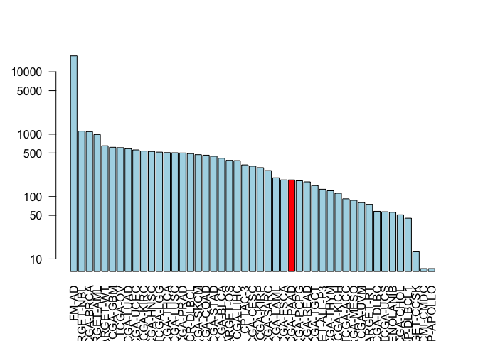

Class18
================
Kellie Lemoine
May 31, 2019

``` r
library(GenomicDataCommons)
```

    ## Loading required package: magrittr

    ## 
    ## Attaching package: 'GenomicDataCommons'

    ## The following object is masked from 'package:stats':
    ## 
    ##     filter

``` r
library(TCGAbiolinks)
library(maftools)
```

``` r
library(GenomicDataCommons)
status()
```

    ## $commit
    ## [1] "3e22a4257d5079ae9f7193950b51ed9dfc561ed1"
    ## 
    ## $data_release
    ## [1] "Data Release 17.0 - June 05, 2019"
    ## 
    ## $status
    ## [1] "OK"
    ## 
    ## $tag
    ## [1] "1.21.0"
    ## 
    ## $version
    ## [1] 1

Querying the GDC from R
=======================

``` r
projects <- getGDCprojects()
head(projects)
```

    ##   dbgap_accession_number
    ## 1              phs001287
    ## 2              phs001374
    ## 3              phs001628
    ## 4              phs000466
    ## 5              phs000467
    ## 6              phs001179
    ##                                                                                                                                                                                                                                                                                                                                                                                                                                                                                                                                                                                                                                 disease_type
    ## 1                                                                                                                                                                                                                                                                                                                                                                                                                                                                                                                                                                                                               Adenomas and Adenocarcinomas
    ## 2                                                                                                                                                                                                                                                                                                                                                                                                                                                                                                                                                                                         Epithelial Neoplasms, NOS, Squamous Cell Neoplasms
    ## 3                                                                                                                                                                                                                                                                                                                                                                                                                                                                                                                                                                                                                          Myeloid Leukemias
    ## 4                                                                                                                                                                                                                                                                                                                                                                                                                                                                                                                                                                                                           Clear Cell Sarcoma of the Kidney
    ## 5                                                                                                                                                                                                                                                                                                                                                                                                                                                                                                                                                                                                                              Neuroblastoma
    ## 6 Germ Cell Neoplasms, Acinar Cell Neoplasms, Miscellaneous Tumors, Thymic Epithelial Neoplasms, Gliomas, Basal Cell Neoplasms, Neuroepitheliomatous Neoplasms, Ductal and Lobular Neoplasms, Complex Mixed and Stromal Neoplasms, Complex Epithelial Neoplasms, Adnexal and Skin Appendage Neoplasms, Mesothelial Neoplasms, Mucoepidermoid Neoplasms, Not Reported, Specialized Gonadal Neoplasms, Cystic, Mucinous and Serous Neoplasms, Adenomas and Adenocarcinomas, Epithelial Neoplasms, NOS, Squamous Cell Neoplasms, Transitional Cell Papillomas and Carcinomas, Paragangliomas and Glomus Tumors, Nevi and Melanomas, Meningiomas
    ##   releasable released state
    ## 1      FALSE     TRUE  open
    ## 2      FALSE     TRUE  open
    ## 3      FALSE     TRUE  open
    ## 4       TRUE     TRUE  open
    ## 5       TRUE     TRUE  open
    ## 6      FALSE     TRUE  open
    ##                                                                                                                                                                                                                                                                                                                                                                                                                                                                                                                                                                                                                                                                                                                                                                                                                                                               primary_site
    ## 1                                                                                                                                                                                                                                                                                                                                                                                                                                                                                                                                                                                                                                                                                                                                                                                                                                   Kidney, Bronchus and lung, Uterus, NOS
    ## 2                                                                                                                                                                                                                                                                                                                                                                                                                                                                                                                                                                                                                                                                                                                                                                                                                                                        Bronchus and lung
    ## 3                                                                                                                                                                                                                                                                                                                                                                                                                                                                                                                                                                                                                                                                                                                                                                                                                            Hematopoietic and reticuloendothelial systems
    ## 4                                                                                                                                                                                                                                                                                                                                                                                                                                                                                                                                                                                                                                                                                                                                                                                                                                                                   Kidney
    ## 5                                                                                                                                                                                                                                                                                                                                                                                                                                                                                                                                                                                                                                                                                                                                                                                                                                                           Nervous System
    ## 6 Testis, Gallbladder, Unknown, Other and unspecified parts of biliary tract, Adrenal gland, Thyroid gland, Spinal cord, cranial nerves, and other parts of central nervous system, Peripheral nerves and autonomic nervous system, Stomach, Cervix uteri, Bladder, Small intestine, Breast, Prostate gland, Other and unspecified female genital organs, Other and unspecified major salivary glands, Rectum, Retroperitoneum and peritoneum, Pancreas, Heart, mediastinum, and pleura, Bronchus and lung, Liver and intrahepatic bile ducts, Other and ill-defined sites, Thymus, Penis, Nasopharynx, Ovary, Uterus, NOS, Vulva, Anus and anal canal, Other and unspecified urinary organs, Trachea, Ureter, Other endocrine glands and related structures, Not Reported, Colon, Kidney, Vagina, Skin, Esophagus, Eye and adnexa, Other and ill-defined digestive organs
    ##              project_id                    id
    ## 1               CPTAC-3               CPTAC-3
    ## 2        VAREPOP-APOLLO        VAREPOP-APOLLO
    ## 3 BEATAML1.0-CRENOLANIB BEATAML1.0-CRENOLANIB
    ## 4           TARGET-CCSK           TARGET-CCSK
    ## 5            TARGET-NBL            TARGET-NBL
    ## 6                 FM-AD                 FM-AD
    ##                                                                                              name
    ## 1                                                                                                
    ## 2                                                          VA Research Precision Oncology Program
    ## 3 Clinical Resistance to Crenolanib in Acute Myeloid Leukemia Due to Diverse Molecular Mechanisms
    ## 4                                                                Clear Cell Sarcoma of the Kidney
    ## 5                                                                                   Neuroblastoma
    ## 6                                       Foundation Medicine Adult Cancer Clinical Dataset (FM-AD)
    ##        tumor
    ## 1          3
    ## 2     APOLLO
    ## 3 CRENOLANIB
    ## 4       CCSK
    ## 5        NBL
    ## 6         AD

``` r
cases_by_project <- cases() %>%
  facet("project.project_id") %>%
  aggregations()
head(cases_by_project)
```

    ## $project.project_id
    ##                      key doc_count
    ## 1                  FM-AD     18004
    ## 2             TARGET-NBL      1120
    ## 3              TCGA-BRCA      1098
    ## 4             TARGET-AML       988
    ## 5              TARGET-WT       652
    ## 6               TCGA-GBM       617
    ## 7                TCGA-OV       608
    ## 8              TCGA-LUAD       585
    ## 9              TCGA-UCEC       560
    ## 10             TCGA-KIRC       537
    ## 11             TCGA-HNSC       528
    ## 12              TCGA-LGG       516
    ## 13             TCGA-THCA       507
    ## 14             TCGA-LUSC       504
    ## 15             TCGA-PRAD       500
    ## 16          NCICCR-DLBCL       489
    ## 17             TCGA-SKCM       470
    ## 18             TCGA-COAD       461
    ## 19             TCGA-STAD       443
    ## 20             TCGA-BLCA       412
    ## 21             TARGET-OS       381
    ## 22             TCGA-LIHC       377
    ## 23               CPTAC-3       322
    ## 24             TCGA-CESC       307
    ## 25             TCGA-KIRP       291
    ## 26             TCGA-SARC       261
    ## 27             TCGA-LAML       200
    ## 28             TCGA-ESCA       185
    ## 29             TCGA-PAAD       185
    ## 30             TCGA-PCPG       179
    ## 31             TCGA-READ       172
    ## 32             TCGA-TGCT       150
    ## 33         TARGET-ALL-P3       131
    ## 34             TCGA-THYM       124
    ## 35             TCGA-KICH       113
    ## 36              TCGA-ACC        92
    ## 37             TCGA-MESO        87
    ## 38              TCGA-UVM        80
    ## 39             TARGET-RT        75
    ## 40             TCGA-DLBC        58
    ## 41              TCGA-UCS        57
    ## 42 BEATAML1.0-CRENOLANIB        56
    ## 43             TCGA-CHOL        51
    ## 44           CTSP-DLBCL1        45
    ## 45           TARGET-CCSK        13
    ## 46             HCMI-CMDC         7
    ## 47        VAREPOP-APOLLO         7

``` r
x <- cases_by_project$project.project_id

# Make a custom color vector for our plot
colvec <- rep("lightblue", nrow(x))
colvec[x$key == "TCGA-PAAD"] <- "red"

# Plot with 'log' for y axis and rotate labels with 'las'
#par(___)  
barplot(x$doc_count, names.arg=x$key, log="y", col=colvec, las=2)
```



Hands on Part 2
===============

``` r
library(bio3d)
```

``` r
seqs <- read.fasta("lecture18_sequences.fa")
seqs
```

    ##              1        .         .         .         .         .         60 
    ## P53_wt       MEEPQSDPSVEPPLSQETFSDLWKLLPENNVLSPLPSQAMDDLMLSPDDIEQWFTEDPGP
    ## P53_mutant   MEEPQSDPSVEPPLSQETFSDLWKLLPENNVLSPLPSQAMLDLMLSPDDIEQWFTEDPGP
    ##              **************************************** ******************* 
    ##              1        .         .         .         .         .         60 
    ## 
    ##             61        .         .         .         .         .         120 
    ## P53_wt       DEAPRMPEAAPPVAPAPAAPTPAAPAPAPSWPLSSSVPSQKTYQGSYGFRLGFLHSGTAK
    ## P53_mutant   DEAPWMPEAAPPVAPAPAAPTPAAPAPAPSWPLSSSVPSQKTYQGSYGFRLGFLHSGTAK
    ##              **** ******************************************************* 
    ##             61        .         .         .         .         .         120 
    ## 
    ##            121        .         .         .         .         .         180 
    ## P53_wt       SVTCTYSPALNKMFCQLAKTCPVQLWVDSTPPPGTRVRAMAIYKQSQHMTEVVRRCPHHE
    ## P53_mutant   SVTCTYSPALNKMFCQLAKTCPVQLWVDSTPPPGTRVRAMAIYKQSQHMTEVVRRCPHHE
    ##              ************************************************************ 
    ##            121        .         .         .         .         .         180 
    ## 
    ##            181        .         .         .         .         .         240 
    ## P53_wt       RCSDSDGLAPPQHLIRVEGNLRVEYLDDRNTFRHSVVVPYEPPEVGSDCTTIHYNYMCNS
    ## P53_mutant   RCSDSDGLAPPQHLIRVEGNLRVEYLDDRNTFVHSVVVPYEPPEVGSDCTTIHYNYMCNS
    ##              ******************************** *************************** 
    ##            181        .         .         .         .         .         240 
    ## 
    ##            241        .         .         .         .         .         300 
    ## P53_wt       SCMGGMNRRPILTIITLEDSSGNLLGRNSFEVRVCACPGRDRRTEEENLRKKGEPHHELP
    ## P53_mutant   SCMGGMNRRPILTIITLEV-----------------------------------------
    ##              ******************                                           
    ##            241        .         .         .         .         .         300 
    ## 
    ##            301        .         .         .         .         .         360 
    ## P53_wt       PGSTKRALPNNTSSSPQPKKKPLDGEYFTLQIRGRERFEMFRELNEALELKDAQAGKEPG
    ## P53_mutant   ------------------------------------------------------------
    ##                                                                           
    ##            301        .         .         .         .         .         360 
    ## 
    ##            361        .         .         .  393 
    ## P53_wt       GSRAHSSHLKSKKGQSTSRHKKLMFKTEGPDSD
    ## P53_mutant   ---------------------------------
    ##                                                
    ##            361        .         .         .  393 
    ## 
    ## Call:
    ##   read.fasta(file = "lecture18_sequences.fa")
    ## 
    ## Class:
    ##   fasta
    ## 
    ## Alignment dimensions:
    ##   2 sequence rows; 393 position columns (259 non-gap, 134 gap) 
    ## 
    ## + attr: id, ali, call

``` r
seqs$ali[,41]
```

    ##     P53_wt P53_mutant 
    ##        "D"        "L"

``` r
start.ind <- 41 - 8
end.ind <- 41 + 8

sequence1 <- seqs$ali[, start.ind:end.ind]
```

``` r
seqs$ali[,65]
```

    ##     P53_wt P53_mutant 
    ##        "R"        "W"

``` r
start.ind <- 65 - 8
end.ind <- 65 + 8

sequence2 <- seqs$ali[, start.ind:end.ind]
```

Find the sites (i.e. amino acids that are different)

``` r
ide <- conserv(seqs, method="identity")
mismatch.inds<- which(ide < 1)
```

Find the positions in mismatch.inds that are NOT in gap.inds

``` r
gaps <- gap.inspect(seqs)
gap.inds <- gaps$t.inds
```

``` r
tumor.sites <- mismatch.inds[!mismatch.inds %in% gap.inds]
```

``` r
seqs$ali[,tumor.sites]
```

    ##            [,1] [,2] [,3] [,4]
    ## P53_wt     "D"  "R"  "R"  "D" 
    ## P53_mutant "L"  "W"  "V"  "V"

``` r
ids <- paste(seqs$ali[1,tumor.sites], tumor.sites,seqs$ali[2,tumor.sites], sep="-")
ids
```

    ## [1] "D-41-L"  "R-65-W"  "R-213-V" "D-259-V"

``` r
start.ind <- tumor.sites - 8
end.ind <- tumor.sites + 8

tumor <- NULL
for(i in 1:length(start.ind)) {
  tumor <- seqbind(tumor, seqs$ali[2, start.ind[i]:end.ind[i]]) }

tumor
```

    ##        1        .      17 
    ## seq1   SPLPSQAMLDLMLSPDD
    ## seq2   DPGPDEAPWMPEAAPPV
    ## seq3   YLDDRNTFVHSVVVPYE
    ## seq4   ILTIITLEV--------
    ##                          
    ##        1        .      17 
    ## 
    ## Call:
    ##   seqbind(tumor, seqs$ali[2, start.ind[i]:end.ind[i]])
    ## 
    ## Class:
    ##   fasta
    ## 
    ## Alignment dimensions:
    ##   4 sequence rows; 17 position columns (9 non-gap, 8 gap) 
    ## 
    ## + attr: id, ali, call

``` r
write.fasta(ids=ids, ali=tumor, file="subsequences.fa")
```
